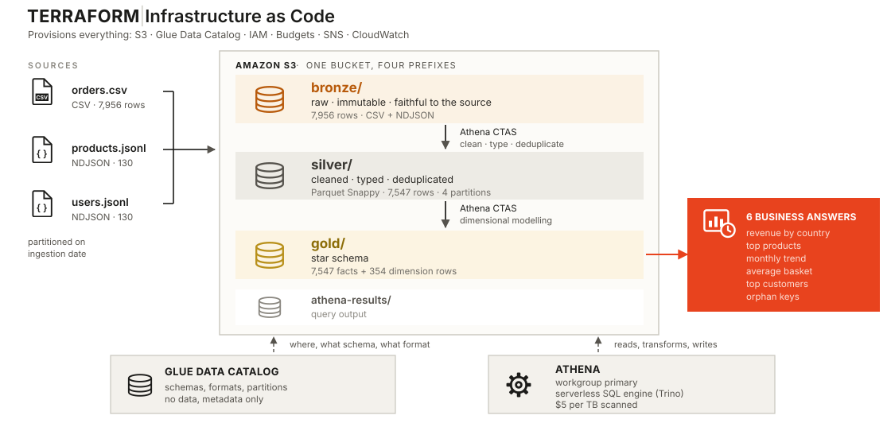

# E-commerce Data Lake on AWS

A hands-on Cloud Data Engineering project that builds a reproducible AWS data lake from raw e-commerce sources, transforms the data through a bronze → silver → gold medallion architecture, models the final layer as a star schema, and validates the resulting business metrics with automated tests.

**Terraform · Amazon S3 · AWS Glue · Amazon Athena · SQL · Python · GitHub Actions**

[](https://github.com/Lionel-Niyondiko/aws-ecommerce-data-lake/actions/workflows/ci.yml)

📘 **[Follow the guided walkthrough →](https://lionel-niyondiko.github.io/aws-ecommerce-data-lake/)**



---

## What we will build

Two sources that do not talk to each other, an ERP order export and an application catalog, are reconciled into a dimensional model that a BI tool can query directly.

| Zone | Rows | Format |
|---|---:|---|
| `bronze/` | 7,956 | CSV + NDJSON |
| `silver/` | 7,547 | Parquet Snappy, 4 partitions |
| `gold/` | 7,547 facts + 354 dimension rows | Parquet |

Net revenue: **$9,284,872.42**.

Of that, **5.00% ($464,547.61)** sits on rows whose product or customer no longer exists in the catalog. A naive `INNER JOIN` deletes that value silently. Handling those orphan keys is the core data quality lesson of the project.

---

## Quick start

There are two ways to use this repository.

### 1. Run the project locally, no AWS required

This is the recommended first step for reviewers and anyone evaluating the repository.

```bash
git clone https://github.com/Lionel-Niyondiko/aws-ecommerce-data-lake.git
cd aws-ecommerce-data-lake

make test
make validate
```

These commands do not create AWS resources and do not require AWS credentials.

Expected result:

```text
23 passed, 15 deselected
Terraform configuration is valid
```

### 2. Run the full AWS project

After completing the prerequisites and configuring AWS authentication:

```bash
cp terraform/terraform.tfvars.example terraform/terraform.tfvars
```

Edit `terraform/terraform.tfvars`:

```hcl
budget_alert_email = "you@example.com"
aws_region         = "us-east-1"
budget_limit_usd   = 20
```

Verify your AWS identity before deploying:

```bash
aws sts get-caller-identity
```

Then run:

```bash
make deploy
make pipeline
make analytics
make test-aws
make destroy
```

> **Important:** confirm the SNS subscription email after `make deploy`. Until the confirmation link is clicked, the CloudWatch notification path remains inactive.

### Windows

Use **Git Bash** with **GNU Make** and `jq`.

The project uses Bash scripts and Unix-style shell commands through the `Makefile`.

**Recommended Windows path:**

```text
C:\dev\aws-ecommerce-data-lake
```

🚧 Avoid cloning into a path containing spaces, for example:

```text
C:\Users\...\DATA FOLDER 001\...
```

Paths containing spaces can cause Bash and Make command resolution problems on Windows.

---

## Prerequisites

### Local development

| Tool | Version | Check |
|---|---|---|
| Git | Current | `git --version` |
| GNU Make | Current | `make --version` |
| Terraform | ≥ 1.5 | `terraform version` |
| Python | ≥ 3.9 | `python --version` |
| pytest | Current | `pytest --version` |
| jq | Current | `jq --version` |

### AWS deployment

| Tool / account | Requirement | Check |
|---|---|---|
| AWS CLI | v2 | `aws --version` |
| AWS account | Required for the full project | AWS console access |
| AWS identity | Permissions for the project resources | `aws sts get-caller-identity` |

The deployment creates resources across S3, Glue, Athena, IAM, Budgets, SNS and CloudWatch.

### AWS authentication

Configure the AWS CLI using your preferred authentication method, then verify the active identity:

```bash
aws sts get-caller-identity
```

---

## Verify your environment

Run the following before the full AWS deployment:

```bash
git --version
make --version
terraform version
python --version
pytest --version
jq --version
aws --version
aws sts get-caller-identity
```

If any command fails, fix the local prerequisite before starting `make deploy`.

---

## What the deployment does

The full project follows this sequence:

```text
Terraform
   ↓
AWS infrastructure
   ↓
S3 bronze
   ↓
Glue catalog
   ↓
Athena transformations
   ↓
S3 silver
   ↓
S3 gold + star schema
   ↓
Six analytics queries
   ↓
AWS assertions
   ↓
Terraform destroy
   ↓
Terraform state = 0 resources
```

More precisely:

1. Terraform provisions the AWS infrastructure.
2. The pipeline ingests the source data into S3.
3. Glue catalogs the datasets.
4. Athena executes the SQL transformations.
5. The test suite verifies row counts, revenue, quality invariants and business queries.
6. `make destroy` removes the project resources.
7. The Terraform state should contain no remaining managed resources.

---

## Full AWS run

Once the prerequisites are verified:

### 1. Create local Terraform variables

```bash
cp terraform/terraform.tfvars.example terraform/terraform.tfvars
```

Edit:

```hcl
budget_alert_email = "you@example.com"
aws_region         = "us-east-1"
budget_limit_usd   = 20
```

Never commit `terraform/terraform.tfvars`.

### 2. Verify AWS authentication

```bash
aws sts get-caller-identity
```

### 3. Deploy

```bash
make deploy
```

Terraform provisions the AWS infrastructure.

### 4. Confirm SNS

Check your email and confirm the SNS subscription created by the deployment.

### 5. Run the pipeline

```bash
make pipeline
```

This runs:

```text
ingest → catalog → silver → gold
```

### 6. Run the analytics

```bash
make analytics
```

This executes the six business questions.

### 7. Run the AWS assertions

```bash
make test-aws
```

The AWS suite verifies the deployed tables and the expected business invariants.

### 8. Destroy the project

```bash
make destroy
```

Then verify that Terraform has no managed resources left:

```bash
terraform -chdir=terraform state list
```

A successful cleanup returns no resources.

---

## Repository layout

```text
terraform/   AWS infrastructure: S3, Glue, IAM, Budget, SNS, CloudWatch
sql/         01_bronze → 02_quality → 03_silver → 04_gold → 05_analytics
scripts/     run_pipeline.sh, the pipeline entry point
data/        three read-only source files, intentionally versioned for reproducibility
tests/       pytest suite, with offline and deployed-AWS tests
docs/        static case study published on GitHub Pages
.github/     CI and Pages workflows
Makefile     project command interface
```

The SQL files are numbered in execution order. Each step ends with checks that prove it worked.

`02_quality.sql` is deliberately separate because it predicts that silver will contain 7,547 rows before producing them. That prediction makes the downstream pipeline verifiable.

---

## Make targets

Run:

```bash
make help
```

Available targets:

```text
make validate   Check Terraform formatting and syntax
make test       Run tests that need no AWS credentials
make deploy     Provision the AWS resources
make pipeline   Ingest, catalog, clean and model
make quality    Profile the raw data
make analytics  Run the six business questions
make test-aws   Verify the deployed lake against expected numbers
make destroy    Tear down every AWS resource
make docs       Serve the guided walkthrough at localhost:8000
```

---

## Cost and cleanup

A normal full lab run is designed to cost only a few cents at this scale, but AWS charges depend on your account, region and usage. Treat the published figure as an estimate, not a guarantee.

The safest habit is:

```bash
make destroy
```

The Terraform configuration uses `force_destroy = true` for the data lake bucket so cleanup does not fail because of remaining objects.

---

## Design decisions

### Why no Airflow?

The pipeline is short and linear. It runs in a few minutes, has no branching, no backfill requirement and no cross-dependency graph. A `Makefile` expresses the orchestration with less operational overhead.

### Why no dbt?

The SQL layer intentionally exposes the Athena CTAS transformations that the project is meant to teach. Adding dbt would hide part of that mechanism without adding enough value for this scope.

### Why no remote Terraform backend?

A remote backend would tie every clone to a shared or pre-existing state bucket. Each user should own the state for their own lab, so state stays local and is ignored by Git.

Knowing when not to add a tool is part of the architecture exercise.

---

## CI and AWS validation

| Workflow | AWS | Trigger | What it proves |
|---|---|---|---|
| `ci.yml` | No | Every push and PR | Terraform validation, shell checks and offline tests |
| `pages.yml` | No | Pushes affecting `docs/` | Publishes the walkthrough |

### CI

`ci.yml` is the zero-cost validation path. It runs on every push and pull request without AWS credentials.

### AWS validation

AWS validation is available locally through the deployed environment:

```bash
make deploy
make pipeline
make analytics
make test-aws
make destroy
```

`make test-aws` verifies the deployed tables and expected business invariants. The AWS validation path is deliberately manual, while CI remains automatic and zero-cost.

---

## Expected results

A successful local validation looks like:

```text
make test
23 passed, 15 deselected

make validate
Success! The configuration is valid.
```

A successful full AWS run should complete:

```text
Terraform apply          ✅
S3 ingestion             ✅
Glue catalog             ✅
Silver transformations   ✅
Gold transformations     ✅
Analytics                ✅
AWS assertions           ✅
Terraform destroy        ✅
Terraform state empty    ✅
```

A complete run should create the expected AWS resources, pass the AWS assertions, then remove all Terraform-managed resources.

The business figures published above are asserted by the test suite. If they change unexpectedly, CI or AWS validation should expose the discrepancy instead of allowing the documentation to drift silently.

---

## Troubleshooting

### `make: command not found`

On Windows, use Git Bash and install GNU Make. Then restart VS Code so the updated PATH is loaded.

### `jq not found`

Install `jq`, then restart Git Bash or VS Code.

Verify:

```bash
jq --version
```

### `bash: C:\Users\...\...: No such file or directory`

On Windows, move the repository to a path without spaces, for example:

```text
C:\dev\aws-ecommerce-data-lake
```

Then reopen the project in VS Code and Git Bash.

### `Unable to locate credentials`

Configure AWS authentication and verify:

```bash
aws sts get-caller-identity
```

### `terraform.tfvars not found`

Create it from the example file:

```bash
cp terraform/terraform.tfvars.example terraform/terraform.tfvars
```

Never commit `terraform/terraform.tfvars`. It is intentionally ignored by Git.


## Reproducibility

Every important number in this README is asserted by `tests/test_pipeline.py` and can be re-verified against a deployed AWS environment with `make test-aws`.

The source data is versioned intentionally, the Terraform provider lock file is committed, and the AWS infrastructure is disposable.

The project has been validated through the complete local-to-AWS lifecycle:

```text
clone
→ offline validation
→ Terraform apply
→ S3 ingestion
→ Glue catalog
→ Athena transformations
→ AWS assertions
→ Terraform destroy
→ empty Terraform state
```

The project is designed so that a reviewer can start with zero-cost local validation and move to a complete AWS run only when they want to evaluate the cloud implementation.

---

## License

MIT
