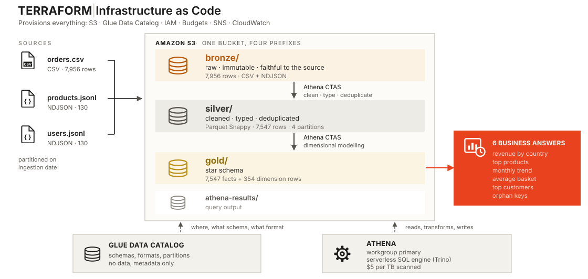

# E-commerce Data Lake on AWS

**English** · [Français](README.fr.md)

An AWS Cloud Data Engineering case study. Two disconnected sources, an ERP order export and an application catalog, are landed in S3, cleaned and reconciled through a bronze → silver → gold medallion architecture, modelled as a star schema, queried with Athena, and checked by automated tests. The whole environment is provisioned with Terraform and removed with one command.

**AWS · Terraform · Amazon S3 · AWS Glue Data Catalog · Amazon Athena · SQL · Python · pytest · Ruff · uv · Taskfile · GitHub Actions**

[](https://github.com/Lionel-Niyondiko/aws-ecommerce-data-lake/actions/workflows/ci.yml)

📘 **[Guided walkthrough →](https://lionel-niyondiko.github.io/aws-ecommerce-data-lake/)** (English / French)

[Local validation](#local-validation-no-aws) · [AWS reproduction](#reproduce-on-aws) · [Architecture](#architecture) · [Analytics](#analytics-report) · [Tests and CI](#tests-and-ci) · [Tasks](#taskfile-tasks)



---

## At a glance

**Problem.** Orders and catalog come from two systems that do not share keys reliably. The order file carries invalid dates, text-typed numbers, negative prices, 39 spellings of 10 countries, and product or customer IDs that no longer exist in the catalog. A naive model either fails on the bad rows or silently drops revenue.

**What it demonstrates**

- Medallion architecture on S3: raw bronze, typed and deduplicated silver, dimensional gold
- Data profiling before cleaning, with the silver row count predicted before it is produced
- Dimensional modelling: one fact table, three dimensions, a declared and tested grain
- Orphan-key handling with convention rows instead of an `INNER JOIN` that loses revenue
- Automated integrity checks: no join fan-out, unique dimension keys, no unhandled orphan key
- Infrastructure as Code with least-privilege IAM, cost guardrails and a clean `terraform destroy`
- A reproducible workflow: pinned Python environment, Ruff and pytest for the Python code, one Taskfile interface, offline CI

**Results** (asserted by the AWS test suite against the deployed lake)

| Layer | Content | Format |
|---|---|---|
| `bronze/` | 7,956 order lines, 130 products, 130 customers | CSV + NDJSON, as received |
| `silver/` | 7,547 order lines (409 removed by explicit cleaning rules) | Parquet + Snappy, 4 monthly partitions |
| `gold/` | 7,547 facts + 354 dimension rows | Parquet, star schema |

- Net revenue: **$9,284,872.42** over 7,439 orders.
- **5.00% of revenue ($464,547.61, 376 rows)** sits on rows whose product or customer is missing from the catalog. Those rows are kept and attached to explicit convention keys (`-1`, `-2`). An `INNER JOIN` would remove them without raising any error.

---

## Architecture

```text
data/ (CSV + NDJSON)
   │  aws s3 cp
   ▼
S3 bronze/   external tables, typed as string       sql/01_bronze.sql
   │  Athena CTAS
   ▼
S3 silver/   typed, cleaned, deduplicated, Parquet  sql/03_silver.sql
   │  Athena CTAS
   ▼
S3 gold/     fact_ventes + dim_date, dim_produit, dim_client   sql/04_gold.sql
   │
   ▼
Six business questions (sql/05_analytics.sql) → HTML / Markdown / JSON / CSV report
```

- **Storage:** one S3 bucket with four prefixes: `bronze/`, `silver/`, `gold/`, `athena-results/` (split into `queries/` for native Athena output and `analytics/` for the generated reports).
- **Catalog and engine:** AWS Glue Data Catalog for metadata, Amazon Athena for every transformation. There is no Glue job and no crawler: tables are created in SQL.
- **Orchestration:** `scripts/run_pipeline.sh`, called by `task pipeline`. `sql/02_quality.sql` is a separate, read-only profiling step.
- **Guardrails:** a least-privilege IAM role for the pipeline, an AWS Budgets alert, and a CloudWatch alarm on bucket size notified through SNS.

The [walkthrough](https://lionel-niyondiko.github.io/aws-ecommerce-data-lake/) explains each layer, the dimensional model and the design decisions step by step.

---

## Local validation (no AWS)

The recommended first step. It needs no AWS account, creates nothing and costs nothing.

```bash
git clone https://github.com/Lionel-Niyondiko/aws-ecommerce-data-lake.git
cd aws-ecommerce-data-lake

uv sync         # Python 3.13 environment from pyproject.toml + uv.lock (pytest, Ruff)
task lint       # Ruff lint of the Python code
task test       # offline tests
task validate   # terraform fmt -check, init -backend=false, validate
```

Expected result:

```text
task lint       All checks passed!
task test       29 passed, 17 deselected
task validate   Success! The configuration is valid.
```

`task check` runs every offline check in one go: Terraform format and validation, tflint, ShellCheck, Ruff lint, Ruff format check and the offline tests. It never calls AWS, so it is the gate to pass before a commit.

`task validate` downloads the AWS and random providers from the Terraform Registry, so it needs internet access, but no AWS credentials.

---

## Reproduce on AWS

### Prerequisites

| Tool | Version | Used by |
|---|---|---|
| Git | current | everything |
| [Task](https://taskfile.dev/installation/) | 3.x | every `task` command |
| uv | current | tests, Ruff, report generation, local web servers (installs Python 3.13 if missing) |
| Terraform | ≥ 1.5 (CI uses 1.9.8) | `task validate`, `deploy`, `destroy`, and reading outputs in the pipeline and AWS tests |
| AWS CLI | v2 | `task pipeline`, `analytics`, `test-aws` |
| jq | current | `task pipeline`, `quality`, `analytics` |
| Bash | current | `task pipeline`, `quality`, `analytics` (they run `scripts/run_pipeline.sh`) |
| tflint, ShellCheck | current | `task check` (CI runs them too) |

On Windows, the local tasks (`check`, `lint`, `test`, `validate`, `fmt`, `docs`) run from any terminal. The AWS pipeline tasks run a Bash script: run them from Git Bash, with `jq` installed, so that `bash` resolves to Git Bash rather than WSL. Clone into a path without spaces (for example `C:\dev\aws-ecommerce-data-lake`); paths with spaces break Bash command resolution.

### AWS identity and permissions

Configure the AWS CLI with any supported method (IAM user keys, AWS IAM Identity Center/SSO, an assumed role), then check which account will be billed:

```bash
aws sts get-caller-identity
```

- **Deployment:** the identity that runs `task deploy` needs permission to create and delete S3, Glue, IAM (role and inline policy), AWS Budgets, SNS and CloudWatch resources. The repository does not ship a deployer policy; a sandbox account with administrator access is the simplest setup.
- **Pipeline role:** Terraform creates `ecommerce-datalake-pipeline`, a least-privilege role limited to the project bucket, the project Glue database and the Athena `primary` workgroup. By default it trusts the exact identity that ran `terraform apply` (override with `trusted_principal_arn`).
- **How `run_pipeline.sh` uses it depends on your identity type:**
  - **IAM user** (long-term or `get-session-token` credentials): the script assumes the pipeline role for one hour, so every pipeline step runs with least privilege.
  - **Already an assumed role** (SSO, `assume-role`, CI OIDC, any ARN containing `:assumed-role/`): the script does not chain into the pipeline role. It runs with your current role, which must itself have S3, Glue and Athena access to the project resources. The least-privilege role is still deployed but is not exercised in that case.
- **AWS tests:** `task test-aws` always runs with your current identity.
- **Region:** taken from `aws_region` (default `us-east-1`, the tested region). The pipeline and tests read it from the Terraform outputs.

The pipeline and the AWS tests read the bucket, database and region from the local Terraform state, so run them from the same clone that ran `task deploy`.

### Configure

```bash
cp terraform/terraform.tfvars.example terraform/terraform.tfvars
```

Set `budget_alert_email` to an address you can read. It is the only required variable; the others have defaults and are documented in the example file. `terraform.tfvars` is git-ignored and must never be committed.

### Run

```bash
task deploy      # terraform init + apply (interactive: review the plan, type yes)
task pipeline    # ingest → catalog → silver → gold
task analytics   # six business questions + report
task test-aws    # 17 checks against the deployed lake
task destroy     # remove every Terraform-managed resource
```

1. **`task deploy`** creates the bucket and its prefixes, the Glue database, the pipeline role, the budget, the SNS topic and the CloudWatch alarm. AWS then sends an **SNS subscription confirmation** to `budget_alert_email`: click the link, otherwise the bucket-size alarm stays silent.
2. **`task pipeline`** uploads the three source files to `bronze/…/ingestion_date=YYYY-MM-DD/`, registers the bronze tables, then rebuilds silver and gold with Athena CTAS statements. It does not run the profiling, the analytics or the tests.
3. **`task quality`** (optional, read-only) runs the profiling queries that justify the silver rules.
4. **`task analytics`** answers the six business questions and generates the report described [below](#analytics-report).
5. **`task test-aws`** checks row counts, revenue, the grain, dimension key uniqueness, the absence of join fan-out and of unhandled orphan keys, calendar continuity and the Parquet/partition layout.
6. **`task destroy`** removes everything, including the bucket contents (`force_destroy = true`). `terraform -chdir=terraform state list` should then print nothing.

### Cost

A full run stays in the cents at this data volume (a few MB in S3, well under 1 GB scanned by Athena), but AWS pricing depends on your account and region. Treat it as an estimate. The AWS Budgets alert applies to the whole account, not only to this project. Run `task destroy` when you are done.

---

## Analytics report

`task analytics` and `task analytics-view` do different things.

| Command | Calls AWS | What it does |
|---|---|---|
| `task analytics` | yes | Runs the 12 statements of `sql/05_analytics.sql` (six business questions) in Athena and generates the report |
| `task analytics-view` | no | Serves the last local report at `http://localhost:8001/report.html`. Recomputes nothing, runs no query |

`task analytics` produces, for each run:

```text
reports/analytics_<YYYY-MM-DD_HHMMSS>/          local run folder
  raw/<query>.json                              Athena result per statement
  report.html · report.md · report.json · report.csv

reports/report.html                             copy of the latest run
reports/analytics_latest.{md,json,csv}

s3://<bucket>/athena-results/analytics/<run>/   archived copy of the run
s3://<bucket>/athena-results/analytics/latest/  always the latest run
s3://<bucket>/athena-results/queries/           native Athena result files
```

The report is generated by `scripts/generate_analytics_report.py` from the Athena JSON results: HTML for reading, Markdown for sharing, JSON for programmatic use and a long-format CSV for spreadsheets. Its content (titles, summary, column names) is in French, like the SQL model. `reports/` is git-ignored.

`task analytics-view` needs a previous `task analytics` in the same clone and stops with a clear message otherwise. Stop the server with `Ctrl+C`.

---

## Tests and CI

```bash
uv run pytest --collect-only -q   # 46 tests collected
task test                         # 29 offline tests
task test-aws                     # 17 tests on the deployed lake
```

- **Offline (29):** source-file shape and anomalies, SQL rules (no `NOT IN`, gold never reads bronze, `LEFT JOIN` for the fact, partition columns last, no column dropped between bronze and gold), repository safety (no hard-coded account ID, state and tfvars ignored), and the report generator on sample Athena results.
- **AWS (17):** the headline figures above plus the model invariants. Expected values are hard-coded on purpose, so a regression cannot hide behind the logic it tests.

| Workflow | Needs AWS | Trigger | What it runs |
|---|---|---|---|
| `ci.yml` | no | every push and PR | Terraform fmt/init/validate + tflint, ShellCheck, Ruff lint and format check, offline tests, SQL and secret guards |
| `pages.yml` | no | push to `main` touching `docs/`, `Taskfile.yml` or `run_pipeline.sh` | checks the walkthrough against `Taskfile.yml` and `run_pipeline.sh`, then publishes it |

The AWS half is deliberately manual: nothing deploys or bills on a schedule.

---

## Taskfile tasks

`Taskfile.yml` is the project's command interface. It holds no logic of its own: each task delegates to the tool that owns the job.

```text
Taskfile.yml
  ├── Terraform        fmt, validate, tflint, apply, destroy
  ├── Ruff             lint and format of the Python code
  ├── pytest           offline and AWS tests
  ├── ShellCheck       the shell script
  ├── docs/            the walkthrough, served locally
  └── scripts/run_pipeline.sh
        ingest · catalog · quality · silver · gold · analytics · sql FILE
```

`task` or `task help` prints the list in workflow order; `task --list` prints it alphabetically.

| Task | Needs AWS | Description |
|---|---|---|
| `task check` | no | Every offline check: `validate`, `tflint`, `shellcheck`, `lint`, `fmt-python-check`, `test` |
| `task test` | no | Run the offline tests |
| `task lint` | no | Lint the Python code (`ruff check`) |
| `task validate` | no | Check Terraform formatting and syntax |
| `task tflint` | no | Lint the Terraform code |
| `task shellcheck` | no | Lint the shell scripts |
| `task fmt` | no | Reformat the Terraform and Python files (`fmt-terraform` + `fmt-python`) |
| `task fmt-python-check` | no | Check the Python formatting (`ruff format --check`) without changing files |
| `task docs` | no | Serve the guided walkthrough at `http://localhost:8000` |
| `task deploy` | yes | Provision the AWS infrastructure (`terraform init` + `apply`) |
| `task pipeline` | yes | Ingest, catalog, clean, model (bronze → silver → gold): `run_pipeline.sh all` |
| `task quality` | yes | Profile the raw data (optional, read-only): `run_pipeline.sh quality` |
| `task analytics` | yes | Run the six business questions and generate the report: `run_pipeline.sh analytics` |
| `task test-aws` | yes | Verify the deployed lake against expected numbers |
| `task destroy` | yes | Tear down every Terraform-managed AWS resource |
| `task analytics-view` | no | Serve the last local report at `http://localhost:8001/report.html` |

`task check` never deploys, destroys or calls AWS. To run a single SQL file against the lake, call the script directly: `./scripts/run_pipeline.sh sql sql/02_quality.sql`.

Ruff is configured in `pyproject.toml` (Python 3.13, 100-character lines, rule sets E, W, F, I, B, UP, PT). `ruff check` finds likely bugs and outdated idioms; `ruff format` only rewrites layout. Neither replaces pytest, which checks behaviour.

---

## Design decisions

- **Bronze is typed as `string`.** One bad date in a typed column fails the whole Athena query; typing belongs to silver, where `TRY_CAST` can count what it rejects.
- **Orphans are kept, not filtered.** Silver keeps the 376 orphan rows; gold maps them to convention keys so every fact stays joinable and every dollar stays reported.
- **Orders are counted as invoice number + date.** Invoice numbers are reused across dates, so `COUNT(DISTINCT invoiceno)` is not additive by month.
- **No Airflow.** The pipeline is short, linear and runs in minutes, with no branching or backfill. A Taskfile and one shell script express it with less operational overhead.
- **Local Terraform state.** One operator, disposable infrastructure; a remote backend would be the next step for a team.

The walkthrough documents these decisions with the alternatives that were rejected.

---

## Repository layout

```text
terraform/   S3, Glue, IAM, Budgets, SNS, CloudWatch + terraform.tfvars.example
sql/         01_bronze → 02_quality → 03_silver → 04_gold → 05_analytics
scripts/     run_pipeline.sh (pipeline entry point), generate_analytics_report.py
data/        the three source files, versioned on purpose for reproducibility
tests/       offline and AWS pytest suites
docs/        the bilingual walkthrough published on GitHub Pages
.github/     CI and Pages workflows
Taskfile.yml    the project's command interface
pyproject.toml  Python 3.13, pytest and Ruff configuration (locked by uv.lock)
```

Local, git-ignored: `.venv/`, `terraform/.terraform/`, `*.tfstate*`, `terraform/terraform.tfvars`, `reports/`.

---

## Scope and limitations

This is a portfolio project, not a production platform. It runs on a small static dataset, with local Terraform state, a single operator and a manually triggered AWS validation. There is no scheduler, no incremental load and no alerting beyond the budget and bucket-size guardrails. The choices are sized for that scope and documented so they can be revisited when the constraints change.

---

## Troubleshooting

| Symptom | Fix |
|---|---|
| `task: command not found` | Install Task ([taskfile.dev/installation](https://taskfile.dev/installation/), for example `winget install Task.Task` or `brew install go-task`), then restart the terminal |
| `jq not found` (Windows) | Install `jq` for Git Bash, then restart the terminal or VS Code |
| `bash: C:\Users\...: No such file or directory` | Move the clone to a path without spaces |
| `Unable to locate credentials` | Configure the AWS CLI, then `aws sts get-caller-identity` |
| `task deploy` prompts for `var.budget_alert_email` | `terraform/terraform.tfvars` is missing: copy it from `terraform.tfvars.example` and fill it in |
| `No Terraform outputs. Run 'task deploy' first.` | Deploy first, from this clone |
| `assume-role failed` | You run as an IAM user that is not the one trusted by the role: redeploy with that identity or set `trusted_principal_arn` |
| `AccessDenied` during the pipeline with SSO or an assumed role | Your current role runs the pipeline directly; it needs S3, Glue and Athena access to the project resources |
| `No local report yet` | Run `task analytics` before `task analytics-view` |

---

## License

[MIT](LICENSE)
